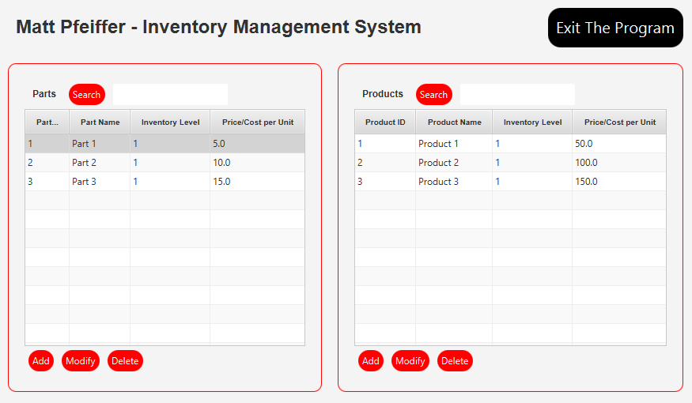

<h1> CompanyInventory </h1>

  <h2>Notable Concepts Involved:</h2>
  <ul>
    <li>User interface design (JavaFX)</li>
    <li>Exception handling</li>
    <li>OOP design principles (e.g. abstraction, inheritance, and encapsulation</li>
  </ul> 

  <h2>Program Flow:</h2>
  <ul>
    <li>Parts and products can be created, modified and deleted.</li>
    <li>Parts are linked to products. Linked parts are displayed in seperate popup window for product.</li>
    <li>Parts are defined as "In-House" or "Outsourced".</li>
    <li>TableViews are updated as parts/products are added/deleted.</li>
    <li>TableViews can be searched based on part/product name or ID.</li>
  </ul> 

  <h2>Main User Interface:</h2>
  <kbd>
    
  </kbd>

